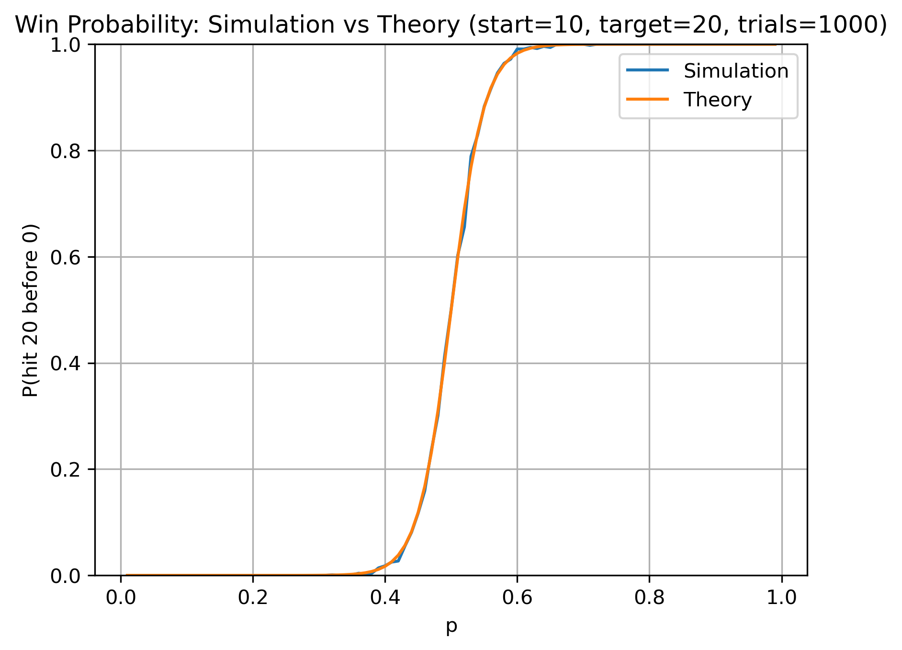
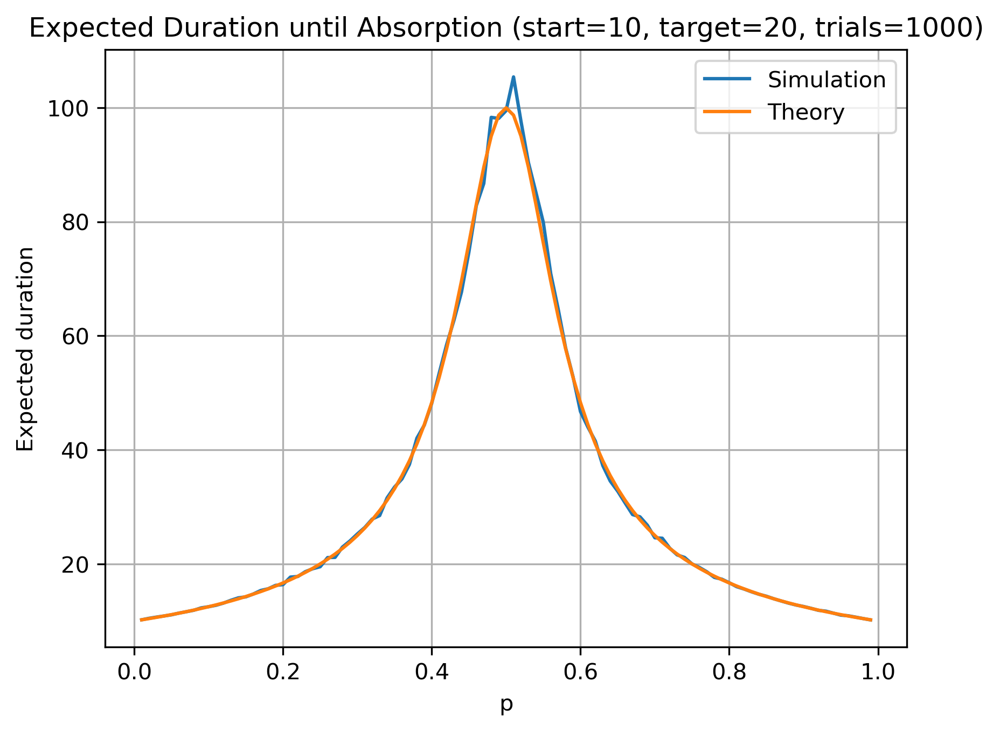
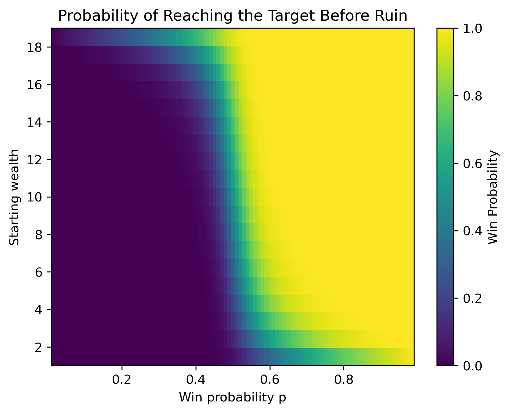

# Gambler's Ruin: Simulation vs Theory

This project explores the classical **Gambler's Ruin problem** using Monte Carlo simulation. 

A gambler repeatedly bets one unit at a time:
- with probability **p** they win one unit
- with probability **1-p** they lose one unit

The game continues until the gambler either:
- reaches a **target wealth**, or
- goes **bankrupt**.

The notebook compares **simulation results with theoretical formulas** for:

- probability of reaching target wealth before ruin
- expected duration of the game
- how these quantities depend on the win probability *p*

---

# Main ideas explored

- random walks with absorbing boundaries
- Monte Carlo simulation of stochastic processes
- comparison of **simulation vs theoretical results**
- distribution of absorption times
- dependence ons tarting wealth and game bias

---

## Example results

### Win probability (Simulation vs Theory)

---

### Expected Duration until Absorption

---

### Heatmap of Win Probability

This heatmap shows how the probability of reaching the target depends on both:

- starting wealth
- win probability *p*

---

## Tools used

- Python
- NumPy
- Matplotlib
- Monte Carlo simulation

# Running the Project

Open the notebook: 'gamblers_ruin_simulation.ipynb' and run all cells sequentially. 

The noteobok will reproduce all simulations and visualiations shown above. 

